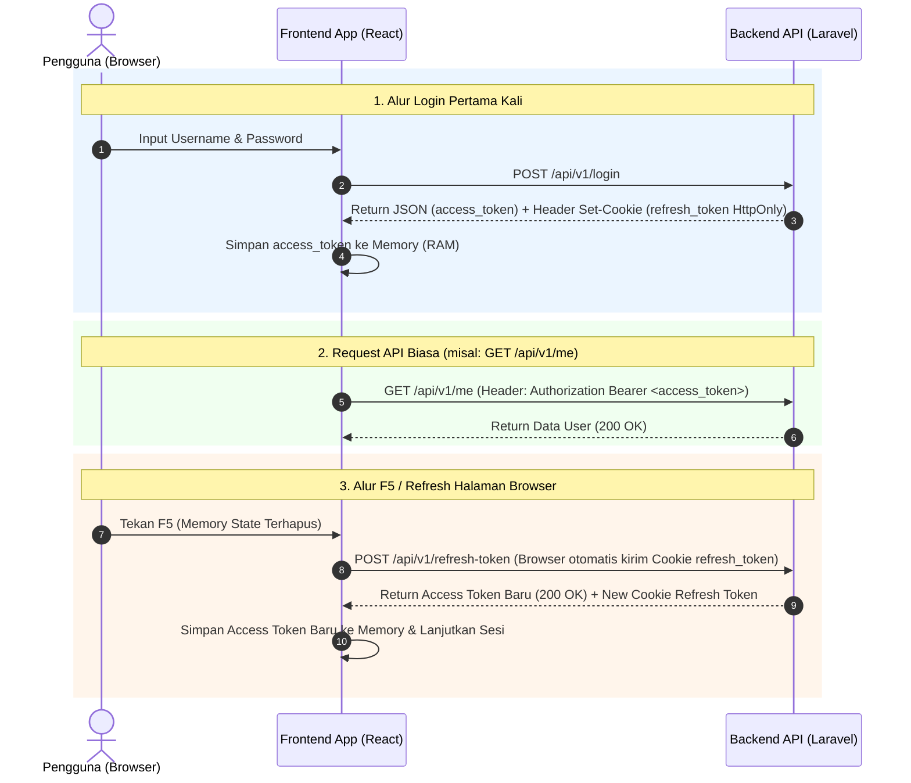

# 📘 Panduan Integrasi Frontend: Refresh Token & HttpOnly Cookie

Dokumen ini adalah panduan lengkap bagi tim **Frontend (React.js / Next.js / Vue.js)** untuk mengintegrasikan mekanisme autentikasi aman dengan **Access Token di Memory State** dan **Refresh Token di HttpOnly Cookie**.

## Implementasi pada Repositori Ini

Contoh di bawah menjelaskan pola integrasi umum. Implementasi aplikasi ini menggunakan
`src/services/axios.ts`, `src/contexts/AuthContext.tsx`, `src/auth/AuthGuard.tsx`,
`src/auth/GuestGuard.tsx`, dan `src/constants/roles.ts`; gunakan file-file tersebut
sebagai acuan saat mengubah autentikasi atau akses halaman.

### Pemulihan Sesi dan Proteksi Halaman

Saat aplikasi dibuka ulang, access token di memory belum tersedia. `AuthContext`
mencoba memulihkan sesi lewat endpoint refresh sebelum menandai autentikasi selesai.
Guard halaman menunggu `isInitialised` sebelum mengarahkan pengguna ke login atau
memeriksa role. Ini mencegah redirect prematur ketika refresh token masih diproses.

Token akses tetap hanya berada di memory. `localStorage` menyimpan profil dan waktu
kedaluwarsa (`userData.user` dan `userData.expires_at`), bukan refresh token. Ketika
respons refresh membawa profil parsial, field yang ada pada profil tersimpan
dipertahankan dan field yang dikirim server diperbarui.

### Role Admin Penuh

Pada frontend ini, role admin/superadmin dikenali melalui `role_id` berikut:

```text
219bc0dd-ec72-4618-b22d-5d5ff612dcaf
```

Nilai tersebut dipetakan menjadi role `admin` di `src/constants/roles.ts`.
Semua rute aplikasi yang terdaftar untuk fitur-fitur terlindungi mengizinkan role
`admin`; beberapa fitur lainnya juga mengizinkan role operasional tertentu.
Karena itu, jika akun yang disebut superadmin tidak dapat membuka rute terlindungi,
periksa nilai persis `user.role_id` pada respons login dan objek
`localStorage.userData.user`. Jika backend mengirim ID atau format berbeda, role
tersebut tidak otomatis dianggap admin dan pemetaan frontend/backend harus
diselaraskan. Jangan mengatasi ketidaksesuaian itu dengan memberi akses umum
(`all`) kepada role yang tidak dikenal.

Hak akses API backend tetap berlaku terpisah dari guard frontend. Lolos dari
proteksi rute frontend tidak menjamin API akan mengizinkan request.

---

## 🛡️ Mengapa Metode Ini Digunakan?

1. **Anti-XSS**: `refresh_token` disimpan dalam **HttpOnly Cookie**, sehingga skrip jahat (XSS) di browser **TIDAK BISA** membaca atau mencuri token tersebut.
2. **Anti-Data Leak**: `access_token` hanya disimpan di dalam **Memory (RAM / React State)** dan **TIDAK DIPERSIST** ke `localStorage` / `sessionStorage`.
3. **Session Persistence**: Saat pengguna me-refresh halaman (F5), aplikasi secara otomatis memanggil endpoint `/api/v1/refresh-token` menggunakan Cookie HttpOnly untuk mendapatkan `access_token` baru tanpa meminta pengguna login ulang.

### Troubleshooting: `Refresh token tidak ditemukan pada cookie`

Pesan ini berasal dari backend ketika request `POST /api/v1/refresh-token`
diterima tanpa cookie refresh. Ini masalah penerbitan/pengiriman cookie, bukan
pemeriksaan role atau izin halaman. Implementasi frontend di repositori ini
sudah mengaktifkan `withCredentials: true` pada request login dan refresh.
Cookie `HttpOnly` memang tidak boleh dibaca atau dibuat lewat JavaScript.

Periksa alur berikut di DevTools browser (**Network** dan **Application/Storage**):

1. Pada respons `POST /api/v1/login`, pastikan backend mengirim header
   `Set-Cookie` untuk refresh token. Jika tidak ada, perbaiki endpoint login
   backend agar menerbitkan cookie setelah autentikasi berhasil.
2. Pastikan cookie tersimpan di bawah host API dan belum kedaluwarsa. Browser
   dapat menolak `Set-Cookie` jika atribut atau konfigurasi CORS tidak cocok.
3. Pada request `POST /api/v1/refresh-token`, periksa Request Headers untuk
   header `Cookie`. Jangan menyalin atau membagikan nilai token/cookie tersebut.
4. Jika cookie tersimpan tetapi tidak ikut terkirim, periksa atribut cookie:
   `Path` harus mencakup `/api/v1/refresh-token` (umumnya gunakan `/`), `Secure`
   harus aktif pada HTTPS, dan `Domain` harus cocok dengan host API. Untuk
   frontend dan API yang benar-benar cross-site, cookie perlu `SameSite=None;
   Secure`. Untuk host berbeda tetapi masih satu site, `SameSite=Lax` dapat
   digunakan.
5. Karena request frontend dan API berbeda origin, backend harus mengizinkan
   origin frontend yang persis pada `Access-Control-Allow-Origin` dan mengirim
   `Access-Control-Allow-Credentials: true`. Jangan gunakan wildcard `*` untuk
   origin pada request dengan credentials. Pastikan konfigurasi berlaku untuk
   endpoint login dan refresh, termasuk preflight OPTIONS bila diperlukan.

Frontend production pada repositori ini mengarah ke
`https://apimain.digitaldatagenerus.com` melalui
`VITE_PUBLIC_REACT_APP_BASE_URL_API`. Jangan mencoba memperbaiki masalah ini
dengan menyimpan refresh token di `localStorage` atau membuat cookie dari
JavaScript; lakukan koreksi pada konfigurasi cookie/CORS backend.

---

## ⚙️ 1. Setup Axios Client (`src/api/axios.js`)

Buat instance Axios dengan `withCredentials: true` agar browser otomatis menyertakan Cookie HttpOnly pada setiap request.

```javascript
import axios from 'axios';

// 1. Inisialisasi Axios dengan credentials enabled
const api = axios.create({
  baseURL: import.meta.env.VITE_API_BASE_URL || 'http://localhost:8000/api/v1',
  headers: {
    'Content-Type': 'application/json',
    'Accept': 'application/json',
  },
  withCredentials: true, // ⚠️ WAJIB: Agar Cookie HttpOnly dikirim & diterima browser
});

// Variable internal untuk menyimpan Access Token di memory (RAM)
let inMemoryAccessToken = null;

export const setAccessToken = (token) => {
  inMemoryAccessToken = token;
};

export const getAccessToken = () => inMemoryAccessToken;

// 2. Request Interceptor: Tempelkan Bearer Token jika tersedia di memory
api.interceptors.request.use(
  (config) => {
    if (inMemoryAccessToken) {
      config.headers.Authorization = `Bearer ${inMemoryAccessToken}`;
    }
    return config;
  },
  (error) => Promise.reject(error)
);

// 3. Response Interceptor: Penanganan 401 Unauthorized & Queue Refresh Token
let isRefreshing = false;
let failedQueue = [];

const processQueue = (error, token = null) => {
  failedQueue.forEach((prom) => {
    if (error) {
      prom.reject(error);
    } else {
      prom.resolve(token);
    }
  });
  failedQueue = [];
};

api.interceptors.response.use(
  (response) => response,
  async (error) => {
    const originalRequest = error.config;

    // A. Jika error 401 terjadi saat memanggil endpoint refresh-token itu sendiri:
    // Berarti refresh_token di cookie sudah expired/invalid -> Paksa Logout.
    if (originalRequest.url.includes('/refresh-token')) {
      setAccessToken(null);
      return Promise.reject(error);
    }

    // B. Jika error 401 dan request belum pernah di-retry
    if (error.response?.status === 401 && !originalRequest._retry) {
      // Jika proses refresh token sedang berjalan oleh request lain, masukkan ke antrean
      if (isRefreshing) {
        return new Promise((resolve, reject) => {
          failedQueue.push({ resolve, reject });
        })
          .then((token) => {
            originalRequest.headers.Authorization = `Bearer ${token}`;
            return api(originalRequest);
          })
          .catch((err) => Promise.reject(err));
      }

      originalRequest._retry = true;
      isRefreshing = true;

      try {
        // Panggil endpoint refresh-token (Cookie refresh_token dikirim otomatis oleh browser)
        const response = await api.post('/refresh-token');
        const newToken = response.data.data.token;

        // Simpan access_token baru ke memory
        setAccessToken(newToken);
        processQueue(null, newToken);

        // Ulangi request asli yang sempat gagal tadi dengan token baru
        originalRequest.headers.Authorization = `Bearer ${newToken}`;
        return api(originalRequest);
      } catch (refreshError) {
        processQueue(refreshError, null);
        setAccessToken(null);

        // Redirect ke halaman login jika refresh token gagal
        if (window.location.pathname !== '/login') {
          window.location.href = '/login';
        }
        return Promise.reject(refreshError);
      } finally {
        isRefreshing = false;
      }
    }

    return Promise.reject(error);
  }
);

export default api;
```

---

## 🔐 2. Auth Context Provider (`src/context/AuthContext.jsx`)

Context ini menangani status login user, proses login, logout, dan **pengecekan otomatis sesi saat aplikasi pertama kali dimuat / di-refresh (F5)**.

```jsx
import React, { createContext, useContext, useState, useEffect } from 'react';
import api, { setAccessToken } from '../api/axios';

const AuthContext = createContext(null);

export const AuthProvider = ({ children }) => {
  const [user, setUser] = useState(null);
  const [isLoading, setIsLoading] = useState(true);

  // A. Pengecekan otomatis saat halaman pertama kali dibuka / F5
  useEffect(() => {
    const checkAuthStatus = async () => {
      try {
        // Minta access_token baru menggunakan HttpOnly Cookie yang ada di browser
        const response = await api.post('/refresh-token');
        const { token, user: userData } = response.data.data;

        setAccessToken(token);
        setUser(userData);
      } catch (error) {
        // Pengguna belum login atau cookie refresh_token telah expired
        setAccessToken(null);
        setUser(null);
      } finally {
        setIsLoading(false);
      }
    };

    checkAuthStatus();
  }, []);

  // B. Fungsi Login
  const login = async (username, password) => {
    const response = await api.post('/login', { username, password });
    const { token, user: userData } = response.data.data;

    // Simpan token ke memory state & Axios instance
    setAccessToken(token);
    setUser(userData);

    return response.data;
  };

  // C. Fungsi Logout
  const logout = async () => {
    try {
      await api.post('/logout');
    } catch (error) {
      console.error('Logout error:', error);
    } finally {
      // Hapus token di memory state
      setAccessToken(null);
      setUser(null);
      window.location.href = '/login';
    }
  };

  return (
    <AuthContext.Provider value={{ user, isLoading, login, logout, isAuthenticated: !!user }}>
      {children}
    </AuthContext.Provider>
  );
};

export const useAuth = () => useContext(AuthContext);
```

---

## 📝 3. Contoh Halaman Login (`src/pages/Login.jsx`)

```jsx
import React, { useState } from 'react';
import { useNavigate } from 'react-router-dom';
import { useAuth } from '../context/AuthContext';

export default function LoginPage() {
  const [username, setUsername] = useState('');
  const [password, setPassword] = useState('');
  const [errorMsg, setErrorMsg] = useState('');
  const [isSubmitting, setIsSubmitting] = useState(false);

  const { login } = useAuth();
  const navigate = useNavigate();

  const handleSubmit = async (e) => {
    e.preventDefault();
    setErrorMsg('');
    setIsSubmitting(true);

    try {
      await login(username, password);
      // Redirect ke Dashboard setelah login berhasil
      navigate('/dashboard');
    } catch (err) {
      const message = err.response?.data?.message || 'Gagal login. Periksa username dan password.';
      setErrorMsg(message);
    } finally {
      setIsSubmitting(false);
    }
  };

  return (
    <div className="login-container">
      <h2>Login EDDG Digital Data Generus</h2>

      {errorMsg && <div className="alert-error">{errorMsg}</div>}

      <form onSubmit={handleSubmit}>
        <div>
          <label>Username</label>
          <input
            type="text"
            value={username}
            onChange={(e) => setUsername(e.target.value)}
            required
          />
        </div>

        <div>
          <label>Password</label>
          <input
            type="password"
            value={password}
            onChange={(e) => setPassword(e.target.value)}
            required
          />
        </div>

        <button type="submit" disabled={isSubmitting}>
          {isSubmitting ? 'Memproses...' : 'Login'}
        </button>
      </form>
    </div>
  );
}
```

---

## 🛡️ 4. Proteksi Rute / Protected Route (`src/components/ProtectedRoute.jsx`)

```jsx
import React from 'react';
import { Navigate, Outlet } from 'react-router-dom';
import { useAuth } from '../context/AuthContext';

export default function ProtectedRoute() {
  const { isAuthenticated, isLoading } = useAuth();

  // Tampilkan Spinner / Loading saat mengecek cookie pada F5
  if (isLoading) {
    return <div className="loading-spinner">Memuat sesi pengguna...</div>;
  }

  return isAuthenticated ? <Outlet /> : <Navigate to="/login" replace />;
}
```

---

## 📌 Flow Diagram Ringkas


